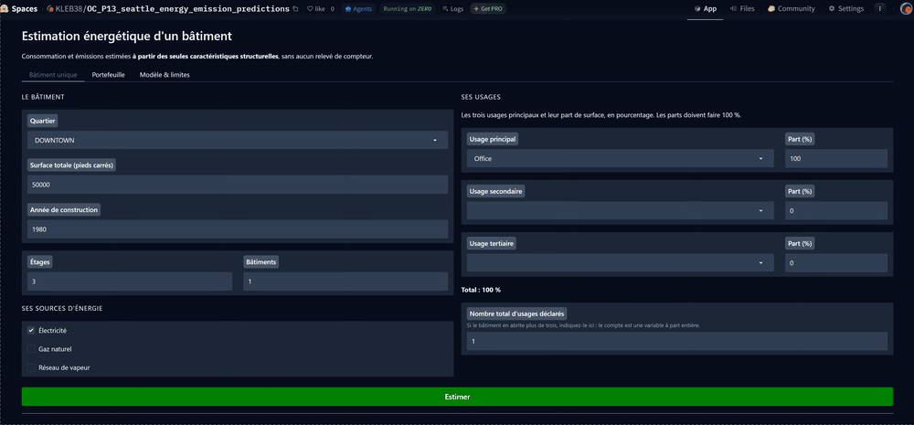
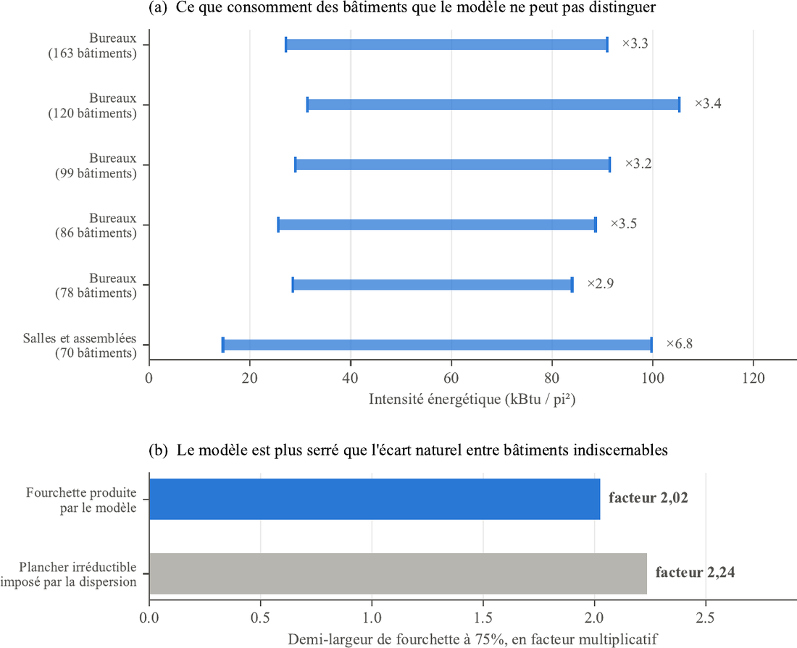
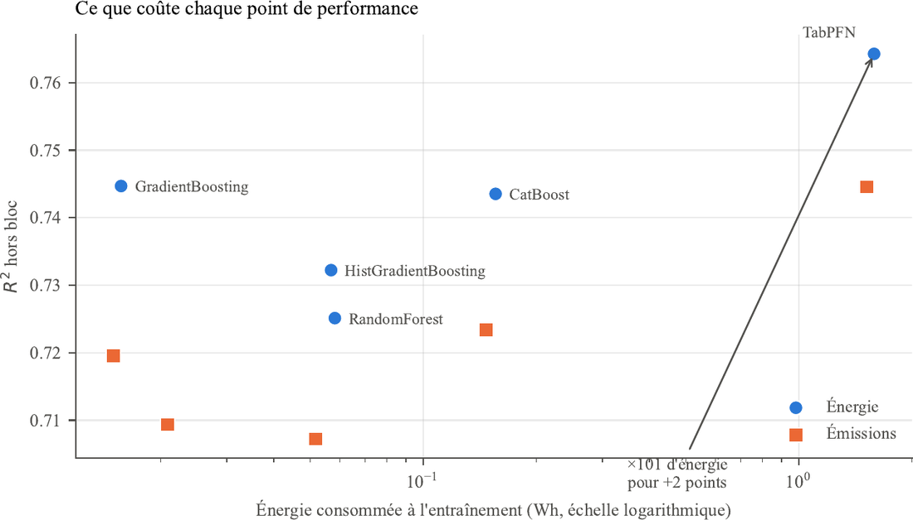
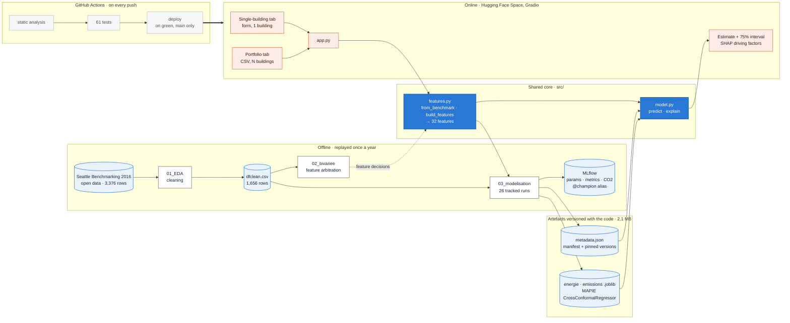

<a id="readme-top"></a>

[![CI][ci-shield]][ci-url]
[![Hugging Face Space][hf-shield]][hf-url]
[![Python 3.12][python-shield]][python-url]
[![uv][uv-shield]][uv-url]
[![Tests][tests-shield]][ci-url]

<div align="center">

<h1>Seattle Building Energy &amp; Emissions</h1>

<p>
  <strong>Estimating a building's energy use and greenhouse-gas emissions from its
  structural characteristics alone — no meter reading required — and shipping every
  estimate with the interval it deserves.</strong>
</p>

<p>
  <a href="https://huggingface.co/spaces/KLEB38/OC_P13_seattle_energy_emission_predictions"><strong>Try the live app »</strong></a>
  <br />
  <a href="rapport/Rapport%20Seattle%20Energy%20Emission%20project.pdf">Project report (FR, 28 p.)</a>
  ·
  <a href="docs/ecarts_vs_P3.md">Decision log</a>
</p>

</div>

<details>
  <summary>Table of Contents</summary>
  <ol>
    <li>
      <a href="#about-the-project">About The Project</a>
      <ul>
        <li><a href="#what-it-demonstrates">What it demonstrates</a></li>
        <li><a href="#results">Results</a></li>
        <li><a href="#built-with">Built With</a></li>
      </ul>
    </li>
    <li><a href="#architecture">Architecture</a></li>
    <li>
      <a href="#getting-started">Getting Started</a>
      <ul>
        <li><a href="#prerequisites">Prerequisites</a></li>
        <li><a href="#installation">Installation</a></li>
      </ul>
    </li>
    <li><a href="#usage">Usage</a></li>
    <li><a href="#project-layout">Project Layout</a></li>
    <li><a href="#documentation">Documentation</a></li>
    <li><a href="#limitations">Limitations</a></li>
    <li><a href="#roadmap">Roadmap</a></li>
    <li><a href="#license">License</a></li>
  </ol>
</details>

## About The Project

<div align="center">
  <a href="https://huggingface.co/spaces/KLEB38/OC_P13_seattle_energy_emission_predictions">
    
  </a>
  <br />
  <em>One building typed in, then a whole portfolio uploaded. Every estimate carries its 75%
  interval, and the fleet comes back sorted by decreasing emissions — the order in which to
  launch audits. <b><a href="https://huggingface.co/spaces/KLEB38/OC_P13_seattle_energy_emission_predictions">Try it live »</a></b></em>
</div>
<br />
Seattle has required every non-residential building over 20,000 sq ft to report its
annual energy use since 2010. The resulting open dataset describes the buildings that
*do* report — and says nothing about the ones that don't, nor about which of them a
sustainability team should audit first.

This repository takes an exploratory notebook study of that dataset and carries it into
production: a public web application, versioned model artefacts, a test suite, a CI/CD
pipeline, and a written log of every decision. Two targets are predicted, because they
answer two different questions — energy use locates the savings, emissions serve the
city's carbon-neutrality objective — and in Seattle they decouple: the electricity is
largely hydro, so a gas-heated building and an all-electric one with the same
consumption do not rank the same on carbon.

### What it demonstrates

**A usable model rather than a flattering one.** The prior study reached an R² of 0.82
on emissions using fuel-mix ratios computed by dividing each energy source by total
consumption — the very quantity the model is asked to predict. Anyone able to fill in
those fields already has the answer. Replacing them with three presence booleans
("is this building connected to gas?") costs ten points on emissions and one on energy,
and makes the model work on an unmetered building. The audit *lowered* the project's
headline number, and that is its main contribution.

| Model | Energy, with ratios | Energy, without | Emissions, with ratios | Emissions, without |
|---|---|---|---|---|
| GradientBoosting | 0.753 | 0.745 | 0.808 | 0.720 |
| CatBoost | 0.756 | 0.744 | **0.821** | **0.723** |

**Uncertainty quantified instead of hidden.** A bare number says nothing about its own
reliability. Every estimate ships with an interval calibrated by conformal prediction on
errors actually observed rather than on an assumed distribution. On buildings the model
has never seen, that interval contains the true value 81% of the time, for a 75% target.

**A measured performance ceiling.** The interval is wide, and that is a property of the
problem rather than a modelling defect: among 163 comparable office buildings, energy
use per square foot ranges from 27 to 91 kBtu — a factor of 3.4 the dataset cannot
explain. An interval built on that dispersion alone, at the same confidence level, would
be worth a factor of 2.24 — the same order of magnitude as the model's 2.02. The width
is set by the available variables, not by the choice of algorithm.

<div align="center">
  
  <br />
  <em><b>Top:</b> buildings the model has no way of distinguishing still consume across a
  factor of 3 to 7. <b>Bottom:</b> the interval the model produces (2.02) is <b>tighter than
  the irreducible floor</b> imposed by that dispersion (2.24) — the width is a property of the
  data, not a modelling failure.</em>
</div>
<br />

**Arbitrations measured, not asserted.** `ParkingRatio`, outlier filtering and
`ConformalizedQuantileRegressor` were each tested and then dropped on evidence. TabPFN,
the benchmark's best score, is excluded on two independent grounds: its licence forbids
production use, and it draws 101× the retained model's energy for two R² points that sit
inside sampling noise.

<div align="center">
  
  <br />
  <em>What each performance point costs. The retained models sit on the left of a log scale;
  TabPFN buys its two extra points at <b>101× the training energy</b>. Measured with
  <a href="https://codecarbon.io/">CodeCarbon</a>, which is what turned an opinion into an
  arbitration.</em>
</div>

### Results

| Target | Model | R² (out-of-fold, log) | Median error | Observed coverage | 75% interval |
|---|---|---|---|---|---|
| Energy use | GradientBoosting | 0.745 | 36.6% | 81.3% | ÷2.0 to ×2.0 |
| GHG emissions | CatBoost | 0.723 | 45.1% | 81.0% | ÷2.3 to ×2.3 |

Trained on 1,655 buildings and 32 features with a `log1p` target. Intervals from
[MAPIE][mapie-url]'s `CrossConformalRegressor` (CV+), nominal level 75%. 26 tracked runs,
61 automated tests, 16 documented deviations from the audited solution.

### Built With

[![Python][python-badge]][python-url]
[![scikit-learn][sklearn-badge]][sklearn-url]
[![CatBoost][catboost-badge]][catboost-url]
[![MAPIE][mapie-badge]][mapie-url]
[![SHAP][shap-badge]][shap-url]
[![Gradio][gradio-badge]][gradio-url]
[![MLflow][mlflow-badge]][mlflow-url]
[![GitHub Actions][actions-badge]][actions-url]
[![uv][uv-badge]][uv-url]

<p align="right">(<a href="#readme-top">back to top</a>)</p>

## Architecture

One module crosses both worlds: `src/features.py`. A building typed into the form and a
row of the training set go through exactly the same transformations, and a test pins that
equality feature by feature. No fitted state is persisted anywhere — the vocabularies
(13 neighbourhoods, 64 usage types folded into 11 groups) are constants versioned with
the code, and an unknown category raises rather than silently producing a phantom column.



Two design choices worth naming. The artefacts (2.1 MB) are versioned in `models/` rather
than pulled from the Hub at startup: at that size, a download would only add a failure
mode. And `metadata.json` is the manifest that drives loading, so the pinned library
versions sit on the execution path rather than in a README — a test cross-checks them
against `requirements.txt` on every commit.

<p align="right">(<a href="#readme-top">back to top</a>)</p>

## Getting Started

### Prerequisites

* Python 3.12
* [uv](https://docs.astral.sh/uv/) — the project's package manager

  ```powershell
  winget install --id=astral-sh.uv -e
  ```

### Installation

```powershell
git clone https://github.com/KL38/OC_P13_ML_MLOPS_Building_Energy_model.git
cd OC_P13_ML_MLOPS_Building_Energy_model
uv sync
```

Model artefacts ship with the repository, so nothing is downloaded at first run.

<p align="right">(<a href="#readme-top">back to top</a>)</p>

## Usage

Launch the app locally:

```powershell
uv run python app.py
```

Run the test suite:

```powershell
uv run pytest
```

The interface has three tabs, named as they appear on screen:

1. **Bâtiment unique** — a form for one building. It opens the app because it is the
   quickest way to make the interval tangible: one estimate, its bounds, and the SHAP
   factors behind it. Usage shares are validated live and must total 100%.
2. **Portefeuille** — upload a CSV and get the estimated fleet back, sorted by decreasing
   emissions, i.e. in the order in which to launch audits. A concentration bar shows how
   few buildings carry half the emissions. This is where the business value sits.
3. **Modèle &amp; limites** — what the tool is for, and what it is not for.

Predictions can also be scripted against the shared core:

```python
import pandas as pd
from src import features, model

description = features.from_benchmark(pd.read_csv("data/dfclean.csv"))
X = features.build_features(description)
model.predict(X.head())  # estimate + lower/upper bound, per target
```

Gradio exposes the same entry points as an auto-generated REST API on the Space.

<p align="right">(<a href="#readme-top">back to top</a>)</p>

## Project Layout

```
.
├── app.py                     # Gradio interface, three tabs
├── requirements.txt           # Space runtime, versions pinned to the artefacts
├── src/
│   ├── features.py            # shared feature engineering (training + inference)
│   └── model.py               # loading, prediction, SHAP explanation
├── models/                    # MAPIE artefacts + metadata.json manifest
├── static/app.css             # application stylesheet
├── tests/                     # 61 tests across four files
├── notebooks/
│   ├── 01_EDA.ipynb           # cleaning → data/dfclean.csv
│   ├── 02_bivariee.ipynb      # bivariate analysis, feature arbitration
│   └── 03_modelisation.ipynb  # benchmark, conformalisation, export
├── docs/                      # decision log and technical notes
├── rapport/                   # LaTeX sources of the project report
└── .github/workflows/ci.yml   # lint → tests → conditional deploy
```

<p align="right">(<a href="#readme-top">back to top</a>)</p>

## Documentation

| Document | Contents |
|---|---|
| [Project report (FR, 28 p.)](rapport/Rapport%20Seattle%20Energy%20Emission%20project.pdf) | Full project-conduct report: needs analysis, audit, target architecture, control, conclusions |
| [`docs/ecarts_vs_P3.md`](docs/ecarts_vs_P3.md) | Log of the 16 deviations from the audited solution, one line written at the moment of the change, plus the deviations knowingly left alone |
| [`docs/plafond_de_performance.md`](docs/plafond_de_performance.md) | Why a ×÷2 interval is the right answer and not an admission of weakness |
| [`docs/note_conformal_prediction.md`](docs/note_conformal_prediction.md) | Conformal prediction explained, with worked numbers |
| [`docs/empreinte_carbone.md`](docs/empreinte_carbone.md) | What the CodeCarbon measurement actually settled, and its three limits |

<p align="right">(<a href="#readme-top">back to top</a>)</p>

## Limitations

* **The tool ranks, it does not price.** An estimate accurate to within a factor of two is
  usable for prioritising audits across a fleet; it is not usable for billing,
  contracting, or sizing an investment. That boundary is written into the interface, not
  only here.
* **The coverage guarantee is marginal.** It holds on average across a fleet, not building
  by building, and does not transport automatically to every typology. It also assumes
  future buildings resemble those used for calibration.
* **One vintage, structural variables only.** The dataset carries no occupancy, opening
  hours or equipment inventory — the very things that drive consumption. See
  [Roadmap](#roadmap).
* **No drift monitoring, by decision.** Data is published annually and the model is
  retrained at the same cadence, for a single business user with no operations team. The
  reasoning is written up in the report rather than left as a gap.
* **Visual rendering is not tested.** The suite covers behaviour, not appearance.

<p align="right">(<a href="#readme-top">back to top</a>)</p>

## Roadmap

- [x] Audit the existing solution and remove the data leak
- [x] Single, shared feature-engineering path for training and inference
- [x] Conformal intervals on both targets
- [x] SHAP explanations expressed as multiplicative factors
- [x] Test suite and CI/CD with conditional deployment
- [x] Carbon footprint measured per model
- [ ] Confront the prioritisation with real audits — the only way to fill in the business
      indicators currently left blank
- [ ] Replay the pipeline across several vintages and measure estimate stability over time
- [ ] Instrument the footprint of *inference*, which is what runs continuously
- [ ] Negotiate access to an occupancy source, even partial

<p align="right">(<a href="#readme-top">back to top</a>)</p>

## License

Code released under the [MIT License](LICENSE). The underlying data is published by the
[City of Seattle](https://data.seattle.gov/) as municipal open data, and the model
artefacts in `models/` are covered by the same licence as the code.

<p align="right">(<a href="#readme-top">back to top</a>)</p>

<!-- MARKDOWN LINKS & IMAGES -->
[ci-shield]: https://img.shields.io/github/actions/workflow/status/KL38/OC_P13_ML_MLOPS_Building_Energy_model/ci.yml?branch=main&style=for-the-badge&label=CI
[ci-url]: https://github.com/KL38/OC_P13_ML_MLOPS_Building_Energy_model/actions/workflows/ci.yml
[hf-shield]: https://img.shields.io/badge/%F0%9F%A4%97%20Hugging%20Face-Live%20Space-FFD21E?style=for-the-badge
[hf-url]: https://huggingface.co/spaces/KLEB38/OC_P13_seattle_energy_emission_predictions
[python-shield]: https://img.shields.io/badge/Python-3.12-3776AB?style=for-the-badge&logo=python&logoColor=white
[uv-shield]: https://img.shields.io/badge/uv-managed-DE5FE9?style=for-the-badge&logo=uv&logoColor=white
[tests-shield]: https://img.shields.io/badge/tests-61%20passing-2A78D6?style=for-the-badge

[python-badge]: https://img.shields.io/badge/Python-3776AB?style=flat-square&logo=python&logoColor=white
[python-url]: https://www.python.org/
[sklearn-badge]: https://img.shields.io/badge/scikit--learn-F7931E?style=flat-square&logo=scikit-learn&logoColor=white
[sklearn-url]: https://scikit-learn.org/
[catboost-badge]: https://img.shields.io/badge/CatBoost-FFCC00?style=flat-square&logoColor=black
[catboost-url]: https://catboost.ai/
[mapie-badge]: https://img.shields.io/badge/MAPIE-2A78D6?style=flat-square
[mapie-url]: https://mapie.readthedocs.io/
[shap-badge]: https://img.shields.io/badge/SHAP-EB6834?style=flat-square
[shap-url]: https://shap.readthedocs.io/
[gradio-badge]: https://img.shields.io/badge/Gradio-FF7C00?style=flat-square&logo=gradio&logoColor=white
[gradio-url]: https://www.gradio.app/
[mlflow-badge]: https://img.shields.io/badge/MLflow-0194E2?style=flat-square&logo=mlflow&logoColor=white
[mlflow-url]: https://mlflow.org/
[actions-badge]: https://img.shields.io/badge/GitHub%20Actions-2088FF?style=flat-square&logo=github-actions&logoColor=white
[actions-url]: https://github.com/features/actions
[uv-badge]: https://img.shields.io/badge/uv-DE5FE9?style=flat-square&logo=uv&logoColor=white
[uv-url]: https://docs.astral.sh/uv/
